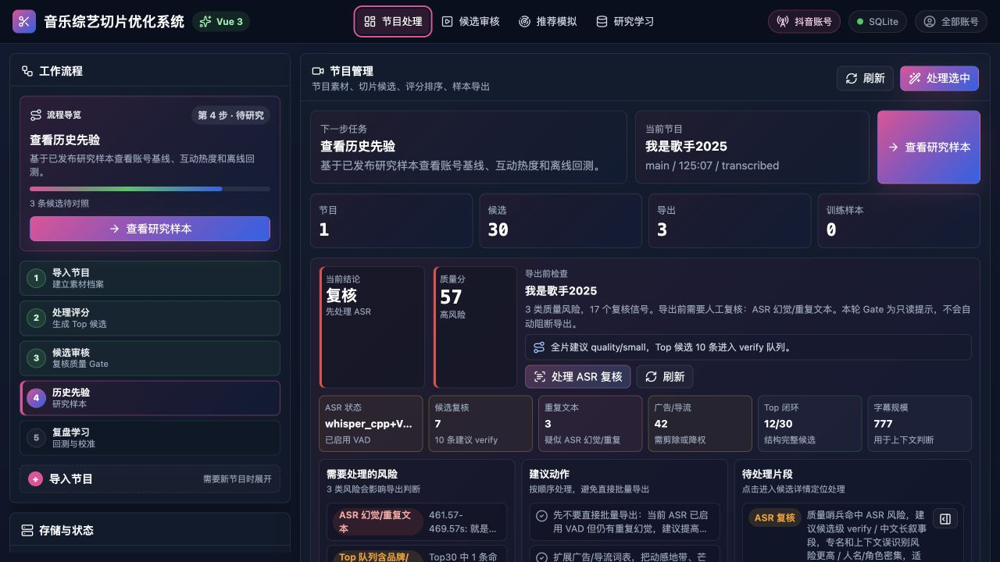
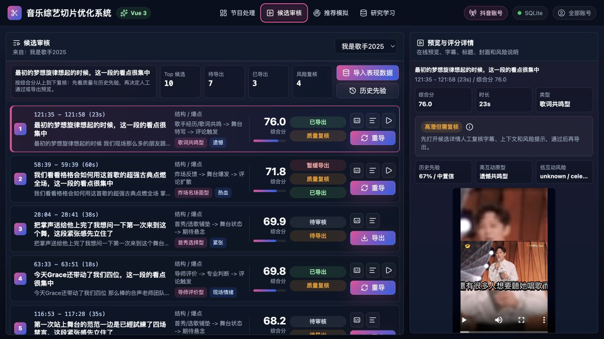
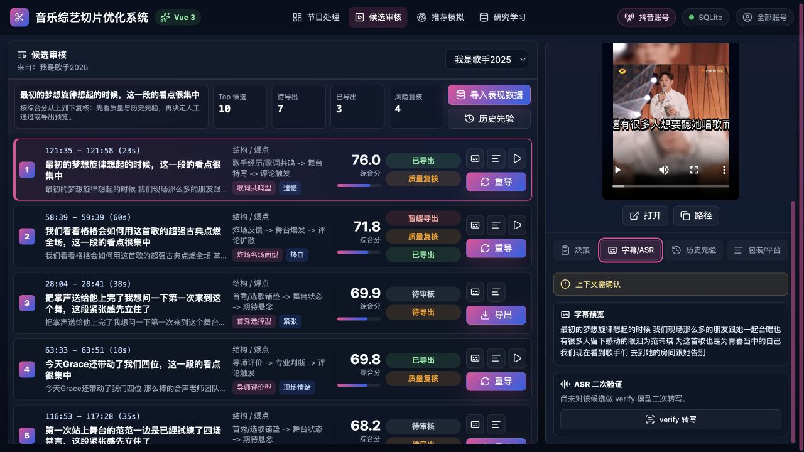
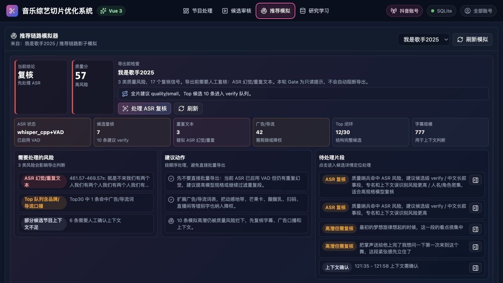
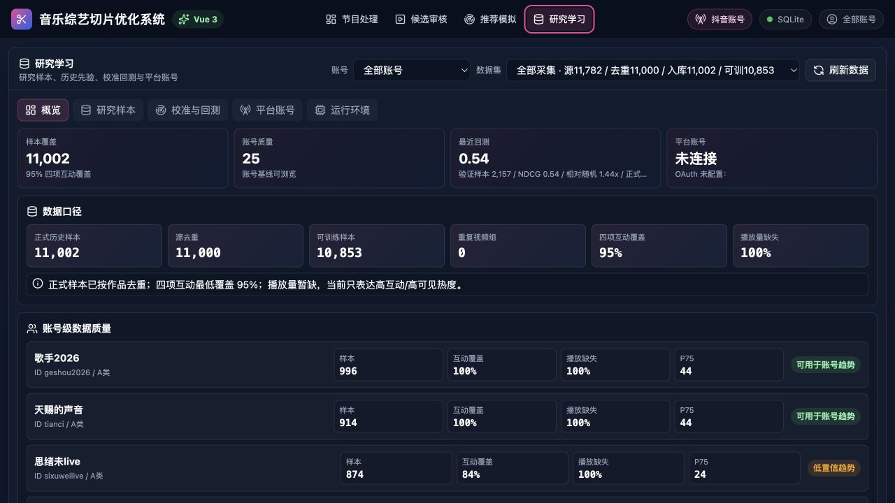
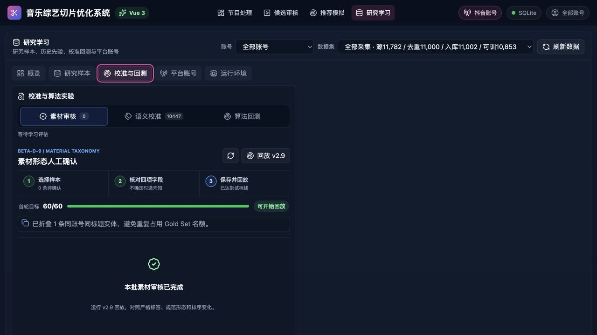
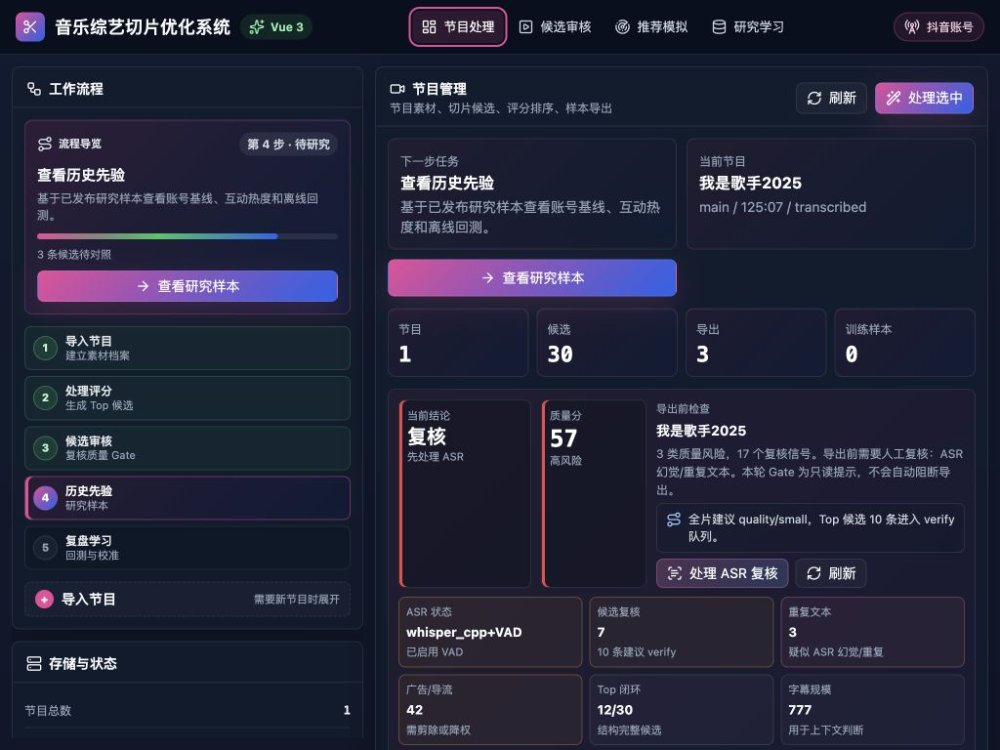

# 前端信息流与交互体验审计

审计日期：2026-07-17
审计范围：节目处理、候选审核、候选详情、推荐模拟、研究学习、1024px 窄屏适配
审计方法：代码结构梳理、真实数据状态浏览、关键流程截图、基础键盘与语义检查

## 结论

当前前端已经具备一套完整、专业、面向高频操作者的深色工作台语言，候选审核页也形成了较成熟的“列表 + 详情”决策结构。核心问题不在视觉风格，而在信息架构仍然更接近后端模块和算法能力的映射，而不是围绕用户任务组织。

最突出的体验成本有四个：

1. 主导航把日常剪辑任务、模拟工具、研究运营放在同一层级，用户需要频繁切换认知模式。
2. 工作流指引、统计和质量风险在多个位置重复，首屏被“系统解释”占据，真正要操作的内容被推到下方。
3. 候选卡、详情、模拟卡都展示大量相似指标，缺少“默认只给结论，按需展开证据”的渐进披露。
4. 研究学习包含样本、标注、算法回测、平台账号、运行环境等多个专业工作台，单页承载过重，布局密度与空间利用也不一致。

建议保留现有视觉设计系统，优先重构导航层级、质量哨兵呈现方式、候选决策路径与研究中心结构。

## 用户的核心任务

从当前功能和真实数据状态看，主要用户任务可归纳为：

1. 导入一个完整节目，确认处理进度与异常。
2. 查看排序后的候选，快速判断哪些值得复核、导出或暂缓。
3. 针对高潜或高风险候选检查字幕、上下文、历史先验和预览。
4. 批量导出候选，并将平台表现数据回流。
5. 管理研究样本、素材形态标注、语义校准、算法回测和平台连接。

前四项属于高频“剪辑生产流”，第五项属于低频但专业度高的“研究运营流”。这两类任务应在一级信息架构上明确分离。

## 建议的信息架构

```text
剪辑工作台
├── 素材与节目
├── 分析任务
├── 候选审核
│   ├── 候选详情
│   ├── 字幕 / ASR
│   ├── 历史先验
│   └── 推荐模拟（作为候选比较工具）
└── 导出与表现回流

研究中心
├── 研究概览
├── 样本与标注
├── 评测与校准
├── 平台连接
└── 模型与运行环境
```

导航调整建议：

- 一级导航只保留“剪辑工作台”和“研究中心”。
- 节目处理、候选审核、导出回流变为剪辑工作台内部的任务阶段。
- 推荐模拟不再作为独立一级页面，放入候选详情或多候选比较模式。
- “抖音账号”从独立全局按钮改为全局连接状态；点击后进入研究中心的“平台连接”。

## 流程审计

### 1. 节目处理：需重点优化



优点：

- 左侧流程步骤清晰，当前阶段有视觉强调。
- 风险结论、质量分、处理动作放在同一区域，系统状态透明。
- 颜色、标签和卡片结构一致，适合专业工具的高信息密度。

问题：

- 左侧“流程导览”和中间“下一步任务”重复表达同一件事。
- 节目、候选、导出、训练样本统计也在流程区域和主内容中重复出现。
- 当前正在“节目处理”，但流程导览显示第 4 步“查看历史先验”，页面任务与步骤语境不一致。
- 质量哨兵占据主要首屏，节目列表、筛选和实际处理对象需要继续向下滚动才能看到。
- 当前节目状态使用 `transcribed` 等英文内部状态，和其他中文操作文案不一致。

建议：

- 左侧仅保留阶段导航、整体进度和异常数量；中间只保留当前节目与主操作。
- 质量哨兵默认压缩为一条可操作的风险横幅：`质量 57 · 3 类风险 · 10 条需复核`，保留一个主要动作“开始复核”。
- 完整质量报告放入抽屉或独立详情层，并记住用户上次展开状态。
- 将节目生命周期统一为中文动作状态，如“待转写、转写中、待评分、待复核、可导出、已回流”。
- 节目列表提前到首屏，并把“处理选中”绑定到明确选中的节目。

### 2. 候选审核：基础最好，但卡片过载



优点：

- “候选列表 + 右侧详情”与用户的快速扫读、深入复核任务高度匹配。
- 候选按分数排序，时间段、标题、结构、风险、状态和操作均可见。
- 选中态明确，预览与评分详情保持上下文，不需要离开页面。
- 候选卡支持键盘 Enter/Space 选择，详情区也有清晰分区。

问题：

- 一张卡同时展示标题、字幕摘要、结构、类型、情绪、分数、评分条、审核状态、质量状态、导出状态、封面状态和四个操作；扫读时焦点过多。
- “已导出、质量复核、综合分”等信号视觉权重接近，用户不容易一眼识别“下一步该做什么”。
- 顶部同时出现当前候选标题、四项统计、两个动作，和卡片列表的首项形成重复。
- `重导` 被设计为每张卡的显著主按钮，会压过更关键的人工复核动作。

建议：

- 候选卡默认只保留：时间、标题、核心原因、分数、风险、下一步动作。
- 字幕摘要、结构、标签和封面信息放入展开态或右侧详情。
- 将状态合并成一个决策状态，例如“待复核 / 可导出 / 已导出 / 暂缓”，附一条原因。
- 主操作按状态变化：高风险候选显示“开始复核”，已通过候选显示“导出”，已导出候选显示“查看预览”；“重导”收进更多菜单。
- 增加批量能力：多选、批量通过、批量导出、仅看风险、仅看未处理。

### 3. 候选详情与字幕复核：结构合理，需要强化决策闭环



优点：

- 预览、字幕、ASR 二次验证放在同一详情上下文，符合人工复核逻辑。
- “上下文需确认”这样的风险提示位置明确。
- 详情分成决策、字幕/ASR、历史先验、包装/平台四个标签，分组清楚。

问题：

- 视频预览占据详情区大量垂直空间，核心风险与复核动作可能落到下方。
- 字幕页展示了“字幕预览”和“ASR 二次验证”，但缺少一个明确的复核结论提交区。
- 右侧四个标签实际对应不同阶段：内容判断、文本修复、研究解释、发布准备，混在同一平级标签内。
- 历史先验和推荐模拟都在解释候选价值，概念上存在重叠。

建议：

- 详情顶部固定：候选标题、风险结论、当前状态、主操作。
- 视频预览支持紧凑/展开两种尺寸，避免遮挡决策内容。
- 字幕复核闭环统一为：查看风险 → 二次转写/编辑 → 确认上下文 → 通过/暂缓。
- 将“历史先验”和“推荐模拟”整合为“判断依据”，分为历史证据与情景模拟两个子区域。
- “包装/平台”仅在候选通过后开放，减少未到阶段的信息干扰。

### 4. 推荐模拟：当前入口与首屏都不匹配任务



当前页面标题是“推荐链路模拟器”，但首屏几乎全部被与节目处理页相同的质量哨兵占据，真正的模拟结果位于首屏以下。

问题：

- 用户进入推荐模拟后，第一眼仍然看到 ASR、重复文本、广告导流等节目质量问题。
- 质量哨兵在节目处理和推荐模拟重复出现，且使用几乎相同的结构和视觉权重。
- 模拟结果的用户目标通常是“比较候选、理解分数变化、决定是否调整”，不需要再次阅读完整节目质量报告。
- 模拟卡继续重复大量评分维度，与候选审核页的分数拆解重叠。

建议：

- 推荐模拟并入候选详情，或作为“比较 2–4 个候选”的工具。
- 首屏直接展示：原分、模拟分、变化原因、受众、瓶颈和建议动作。
- 节目质量只保留一条门禁状态；存在阻断风险时提示“模拟仅供参考”。
- 用“基线 → 调整 → 预测结果”的对比结构替代独立的长卡列表。
- 支持用户切换或输入假设，如标题策略、前 5 秒、时长、受众、风险处理状态。

### 5. 研究学习概览：数据可信，但选择器和长列表负担较大



优点：

- 样本覆盖、账号质量、最近回测、平台状态形成了有价值的研究健康概览。
- 数据口径清楚，能够快速识别播放量缺失、互动覆盖等问题。
- 账号级质量使用一致的指标卡，适合比较。

问题：

- 账号选择器有约 25 个选项，数据集选择器有数十个长选项，原生下拉难以搜索和理解。
- 数据集名称同时包含来源、日期、源数量、去重、入库、可训练等多项元信息，单行扫描成本高。
- 概览直接展开完整账号列表，异常和趋势没有优先于正常项。
- “抖音账号”既出现在全局顶栏，又出现在研究学习内部，信息架构重复。

建议：

- 把账号和数据集改为可搜索、可分组的选择器；数据集详情在选中后展示，不塞进选项文本。
- 概览默认展示异常账号、近期变化和待处理事项，完整账号表放入“账号质量”。
- 为账号质量加入排序、筛选、趋势和“仅看低置信”视图。
- 平台状态做成全局轻量状态，具体授权和导入操作集中到“平台连接”。

### 6. 校准与回测：专业任务被塞进大页面，空间利用不一致



优点：

- 素材审核、语义校准、算法回测三个模式有清楚的内部切换。
- 步骤、进度和完成状态表达明确。

问题：

- 在 1280px 视口下，当前素材审核模块只使用约半屏，右侧大面积空白；与其他页面的高密度形成明显不一致。
- “校准与算法实验”内部又是一套完整的三级工作流，放在“研究学习”的一个标签下，层级过深。
- 完成态仍保留步骤器、回放操作和大块空白，没有给出下一批任务或研究结论。

建议：

- 把素材审核、语义校准、算法回测拆成研究中心的二级页面。
- 完成态优先展示结果摘要、差异、下一批任务和回放入口。
- 使用双栏布局时，右侧承载样本证据、历史记录或批次统计；没有辅助内容时让主区自适应居中并限制舒适阅读宽度。

### 7. 1024px 窄屏：可用，但信息密度进一步放大



优点：

- 1024px 下没有明显横向溢出，顶栏会隐藏次要数据库与账号状态。
- 左侧流程和主工作区仍能并排，核心操作可见。

风险：

- 左栏固定占约 360px，主区中质量摘要、风险卡和指标卡明显变窄。
- 质量哨兵的多栏信息被压成更高的纵向堆叠，用户需要更多滚动。
- 840px 以下虽然会转为单栏，但左侧完整流程会排在主任务之前，移动/小屏上首先看到的仍不是当前处理对象。

建议：

- 1120px 以下把流程侧栏改为可折叠阶段条或顶部步骤器。
- 小屏优先显示当前节目、异常和主操作，完整流程按需展开。
- 保证候选详情在小屏上以抽屉或独立详情页出现，不要把完整详情堆在长列表下方。

## 跨页面问题

### 1. 信息优先级

当前多个页面都在同时强调：系统状态、风险、统计、解释、历史、操作。建议统一为三层：

1. 结论层：用户现在该做什么。
2. 证据层：为什么推荐这么做。
3. 系统层：模型、运行清单、数据口径和技术状态。

系统层默认折叠，只有在异常诊断或研究任务中展开。

### 2. 状态模型

建议统一候选状态：

- 待复核
- 需修复
- 可导出
- 已导出
- 已回流
- 暂缓

质量风险作为状态原因，不再与导出状态并列成多个视觉徽标。

### 3. 批量任务反馈

当前工作台已有刷新、处理、导出等操作，但批量任务的进度、队列和失败恢复不够突出。建议增加统一任务中心：

- 正在处理的节目和候选数量
- 当前步骤和预计剩余时间
- 单项失败与重试
- 完成后的下一步入口

### 4. 文案一致性

- 对用户展示中文业务状态，英文内部枚举只用于调试信息。
- `Gate`、`verify`、`quality/small` 等内部概念改为用户动作语言。
- “历史先验、研究解释、推荐模拟”统一归入“判断依据”，避免概念竞争。

## 可访问性与交互风险

已观察到的优点：

- 页面有“跳到主内容”链接。
- 按钮、输入和选择器有统一的 `:focus-visible` 轮廓。
- 候选卡支持 Enter/Space。
- 多个异步状态使用 `aria-live`。
- 支持 `prefers-reduced-motion`。

需要修复的风险：

1. 节目表格行只绑定鼠标点击，没有键盘焦点和键盘选择；行内“提取、生成候选、评分”按钮也只依赖 `title`，缺少明确的 `aria-label`。
2. 候选卡整体使用 `role="button"`，内部又嵌套多个按钮，语义层级容易让屏幕阅读器和键盘用户困惑。应把卡片本体做成普通 `article`，提供独立的“查看详情”链接/按钮。
3. 顶部与内部标签虽有 `role="tab"` 和 `aria-selected`，但没有 `aria-controls`、对应 `tabpanel` 和完整方向键行为。
4. 多处辅助文字使用 10–11px；对长时间审核任务偏小，建议正文最低 12–13px，关键操作和状态不低于 14px。
5. 灰色辅助文字、紫色边框和深色背景的对比度需要用真实色值进一步测量；本次仅能判断为潜在风险，不能确认 WCAG 等级。

## 优先级建议

### P0：直接改善主流程

1. 一级导航拆为“剪辑工作台 / 研究中心”。
2. 质量哨兵改为全局紧凑门禁，完整报告按需展开，取消跨页重复。
3. 候选卡减负，右侧详情顶部固定结论、风险和主操作。
4. 推荐模拟并入候选详情或候选比较，不再独立占一级导航。

### P1：提高效率与一致性

1. 增加候选批量选择、批量复核和批量导出。
2. 统一节目与候选状态模型、中文文案和下一步动作。
3. 数据集选择器改成可搜索的分组选择器。
4. 研究概览异常优先，完整账号质量放到独立列表。

### P2：可访问性与适配

1. 修复表格行键盘操作、卡片嵌套按钮和标签页语义。
2. 提升最小字号和辅助文字对比度。
3. 1120px 以下折叠流程侧栏，小屏优先当前任务。
4. 统一空态、完成态、错误态和任务进度反馈。

## 建议的衡量指标

重构后可用以下指标验证效果：

- 从节目进入第一个候选复核所需点击数和时间。
- 单个候选从选中到完成复核的中位时长。
- 用户在候选列表与研究学习之间的往返次数。
- 批量导出成功率、失败恢复时间。
- 质量哨兵完整报告的展开率；如果展开率低，说明默认压缩是正确的。
- 小屏下到达当前主操作所需的滚动距离。
- 键盘完成“选择节目 → 选择候选 → 复核 → 导出”的成功率。

## 证据范围与限制

本次审计基于本地真实数据状态、1280×720 和 1024×768 视口、可见 DOM 语义与代码结构。它可以可靠支持信息层级、导航、重复内容、空间利用、基本键盘语义和响应式判断。

本次未覆盖真实屏幕阅读器朗读顺序、全量键盘遍历、精确 WCAG 对比度、弱网/断网失败路径、长任务耗时、动画性能和多用户并发状态。这些项目需要后续专项可访问性与可用性测试。
