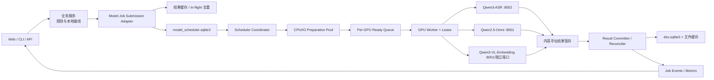
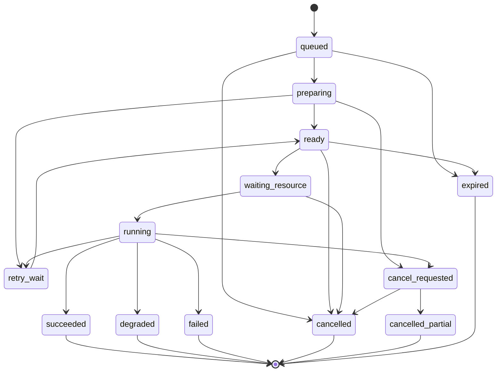
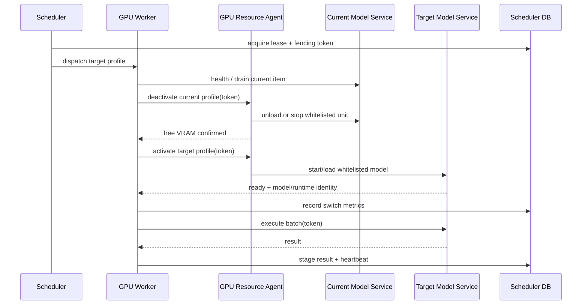

# 本地模型资源调度架构设计

- 设计日期：2026-07-18
- 状态：`validate` / `phase_0_3_lan_canary_enabled`
- 目标版本：`model_scheduler.v1`
- 适用范围：G1 已切短片排名、G2 完整节目切片、G3 本地/公网模型协同中的本地模型执行

## 1. 设计结论

当前 16GB GPU 不适合让 Qwen3-ASR、Qwen2.5-Omni 和 Qwen3-VL-Embedding 自由竞争显存。V1 采用“持久任务队列 + 单 GPU 独占 lease + 模型亲和时间片 + 可恢复结果提交”，而不是在业务接口中直接并发调用模型服务。

核心决策如下：

1. 模型任务写入独立 SQLite `data/db/model_scheduler.sqlite3`，不使用 FastAPI `BackgroundTasks` 作为可靠队列。
2. 每块物理 GPU 同时只有一个执行 Worker 持有 lease；同一 Worker 内也只允许一个 GPU 推理批次运行。
3. Web/API 先返回规则、历史先验或 Whisper 基线，并返回 `model_job.v1`；模型结果完成后增量写回统一候选 contract。
4. 调度优先级首先保护 G1/G2 交互式和正式批处理，再运行 Embedding 补库、Shadow 和 benchmark；低优先级任务通过 aging 防止永久饥饿。
5. 调度器按模型亲和性成组执行任务，减少 8–24 秒级冷加载和人工 ASR/Omni 切换，但不在单次 GPU 推理中途抢占。
6. 相同内容、模型、提示词和参数的任务进行完成结果缓存与 in-flight 合并；允许至少一次执行，只允许幂等一次结果提交。
7. 公网 Provider 不作为 GPU 繁忙时的自动溢出通道。只有现有数据许可、密钥、预算和 Provider policy 显式通过后，才能创建独立的公网任务。
8. V1 不改变排序权重、人工 Gold、候选边界、自动导出或发布行为。

### 1.1 2026-07-18 实施状态

Phase 0–2 与 Phase 3 的 batch-1 基线已落地，默认仍关闭：

- `src/dso/scheduler/` 已实现独立 SQLite schema、active dedupe、完成缓存、优先级/aging、resident-profile 亲和与 parent burst 公平轮转、单资源 lease、heartbeat、expiry、单调 fencing token、attempt/event、取消、重试、逐 item staged artifact 恢复和安全状态响应。
- `POST /videos/{id}/omni-rerank` 与 `/hybrid-slice` 在 `DSO_MODEL_SCHEDULER_ENABLED=1` 时返回 HTTP 202、规则基线和 `model_job.v1`；前端会轮询 job，候选审核不等待 GPU。
- `POST /videos/{id}/extract`、`POST /videos/{id}/asr/shadow` 和 `POST /learning/qwen-embeddings/build` 已接入同一持久队列；ASR 按确定性音频块、Omni 按候选窗口、Embedding 按实体/模态生成 item。
- 独立 `dso model-worker` 消费队列；`model-scheduler-status`、`model-jobs`、`model-job-cancel` 和 `model-scheduler-reconcile` 提供运维入口。
- CPU/IO Preparation Pool 可并发准备 ASR 音频块、Omni 视频窗和 Embedding 代表帧；媒体清单采用内容寻址，GPU 仍严格单 item 串行。
- ASR、Omni 和 Embedding 计算结果先写逐 item staged artifact，再验证 lease/fencing 与输入 hash，最后幂等写 transcript、`slice_scores` 或 embedding 记录；Worker 崩溃后可以复用 staged result，不必重复模型推理。
- `gpu-resource-agent.v1` 已提供 Bearer token、白名单 Profile、单调 fencing 和固定 systemd/wrapper 命令，拒绝任意 shell、unit 或模型路径；已部署到 `192.168.31.143:8010`，token 仅保存在 GPU 主机 0600 env 与本机 macOS Keychain。
- 调度开启时，Qwen3-ASR、Omni 和 Qwen Embedding 客户端的 GPU 请求要求 Worker execution context；健康检查保持只读可用，未迁移的直接调用不会绕过 lease。

当前仍属于 `validate`。冻结合成 contract benchmark `dso-model-scheduler-mixed-20260718-r1` 的 6 个 job/44 个 item 已验证入队 P95 `2.094ms`、调度开销占模拟推理时长 `0.411%`、模拟切模数由 `36` 降至 `3`（`91.67%`）。局域网 19.1 秒 canary 已由正式 Scheduler DB 完成 `ASR 1 item -> Omni 3 windows -> ASR shadow 1 item`，5 个 attempt 全部一次成功，Agent 与 lease fencing 最终一致为 `5`；独立 Profile smoke 还验证了 Embedding 25.8 秒加载和 2048 维真实文本向量。Agent 激活与健康检查超时已拆为默认 1800/5 秒，避免 44 秒 Omni 加载被误判。该 canary 不代表长节目/批量真实 GPU 利用率、输出等价或 OOM 门禁已经通过；batch 2/4 仍未启用。

## 2. 当前基线与问题

### 2.1 当前资源事实

- 目标 GPU 为 NVIDIA GeForce RTX 5080 Laptop GPU，显存 15.47GB。
- Qwen3-ASR-1.7B + ForcedAligner-0.6B 和 Qwen2.5-Omni GPTQ-Int4 不能稳定同驻，当前依赖人工 `dso-asr-on` / `dso-omni-on` 切换。
- Qwen3-ASR 完整节目复测处理 7506.73 秒音频耗时 377.925 秒，RTF `0.050345`；原始吞吐已较好，主要问题是 138 次单条请求和批次期间的模型独占。
- Omni 热模型处理 6 秒真音视频窗口约 5–8 秒，模型加载约 8–24 秒。默认 Top 3 候选、每候选最多三窗，因此单节目最多产生 9 个串行推理单元。
- Embedding 当前按样本、模态逐条调用，业务调用方没有统一队列、优先级、deadline、取消或 GPU lease。
- Omni、Embedding、Material Evidence、Visual Window 等研究入口使用不同缓存目录，已有结果缓存，但缺少全局 in-flight 去重和统一任务状态。

### 2.2 用户可感知问题

- 规则候选已经可用，但模型增强请求可能保持 HTTP 连接数十秒。
- ASR 批次运行时 Omni/Embedding 只能失败回退或等待人工切模。
- 多个页面、CLI 或批处理同时启动时，调用方只能看到 `busy`、HTTP 423、连接失败或模型不匹配，无法知道排队位置和预计执行条件。
- 服务或进程重启后，进程内后台任务没有可靠恢复依据。
- 同一输入被不同入口同时请求时，可能重复准备媒体或重复排队。

### 2.3 根因

当前模型服务已经具备单服务内部串行锁和健康检查，但缺少跨服务、跨业务入口、跨进程的物理 GPU 所有权。服务锁只能避免单个服务自身并发，不能决定 ASR、Omni、Embedding 谁先运行，也不能保证过期调用方不继续提交结果。

## 3. 目标、指标与非目标

### 3.1 目标

- **G1**：批量已切短片导入时允许部分失败、状态查询、重试和及时规则排名；模型增强不阻塞审核入口。
- **G2**：完整节目 ASR、召回和 Omni 复排共享同一个资源队列；长 ASR 任务不能无限阻塞高优先级候选复排。
- **G3**：本地模型有明确的资源、版本、缓存、延迟、失败和降级 contract；公网 Provider 继续独立受许可与预算控制。

重点工程指标：

- API 入队 P50/P95。
- 排队、准备、模型加载、推理、结果提交的分阶段 P50/P95。
- GPU busy ratio、空闲间隙、显存峰值和 OOM 次数。
- 模型冷加载次数、切换次数、驻留时间和 warm-hit rate。
- 每分钟 ASR 音频时长、Omni 窗口数和 Embedding 输入数。
- 结果缓存命中率、in-flight 合并率、重试率、失败率和取消生效率。
- ASR Recall/锚点、G2 Recall@K、统一候选 NDCG@K/Top-K lift 和严重错判率。

### 3.2 非目标

- V1 不建设 Kubernetes、Celery 集群或通用分布式训练调度器。
- V1 不支持 GPU kernel 级抢占；正在执行的单个推理单元只能完成、超时或由服务 watchdog 终止。
- V1 不自动把本地任务转发给公网模型。
- V1 不因为吞吐优化改变提示词、模型分、候选边界、生产排序权重或人工标签。
- V1 不承诺 ASR、Omni、Embedding 同卡共驻；任何共驻必须先通过显存和质量/吞吐 benchmark。

## 4. 总体架构



### 4.1 组件职责

#### Model Job Submission Adapter

- 把现有业务调用转换成 `model_job.v1`，业务模块不直接感知队列表结构。
- 在写队列前检查完成结果缓存和 active dedupe key。
- 保存 subject 引用、输入 hash、模型/API/提示词/参数版本和本地基线引用，不把原始媒体 blob 写入 SQLite。
- 新任务返回 HTTP 202；完成缓存命中返回 HTTP 200；active 重复请求返回原有 job。

#### Scheduler Coordinator

- 选取下一模型族、下一 parent job 和可组成批次的 job items。
- 执行 deadline、优先级、aging、模型亲和、最大 burst 和切换 hysteresis。
- 不执行 FFmpeg、网络上传或模型推理，只产生可审计的 dispatch 决策。
- V1 仅允许一个 active Coordinator；通过 scheduler leader lease 防止多进程重复派发。

#### CPU/IO Preparation Pool

- 负责缓存检查、音频切块、视频转码、代表帧、OCR 前处理、payload schema 校验和输入大小统计。
- 默认并发 2–4，由 CPU、磁盘和局域网上传能力限制，不拥有 GPU lease。
- 输出内容寻址 artifact；准备失败只影响对应 item。

#### GPU Worker

- 每个 `resource_id` 只有一个 Worker 可持有有效 lease。
- 根据 Model Runtime Profile 执行 health、load/unload、batch 构造、推理和 watchdog 协作。
- 每个外部调用携带 job/attempt/fencing token；结果提交前再次校验 token。
- 推理完成先写 staged artifact，再由 Result Committer 幂等写业务库。

#### Result Committer / Reconciler

- 按 job kind 把 staged result 写回 transcript、embedding record、Omni analysis 或 Shadow cache。
- 写回前验证 subject、输入 hash、模型版本、提示词版本和 fencing token。
- 进程在“推理完成、业务库未提交”之间崩溃时，重启后从 staged artifact 重放提交，不重复推理。
- 不把模型失败写成零分、人工 Gold 或成功状态。

### 4.2 部署拓扑

V1 推荐：

```text
应用主机
  dso-web                         读取业务库并提交 job
  dso-model-scheduler             独立 systemd/launchd 进程
  data/db/dso.sqlite3             业务状态
  data/db/model_scheduler.sqlite3 调度状态，WAL

局域网 GPU 主机
  qwen3-asr-service :8002
  multimodal-model-service :8001
  可选 gpu-resource-agent         仅局域网/本机，控制 systemd 与 fencing
```

`dso-model-scheduler` 不运行在 Uvicorn 进程内。Web 重启不应终止已入队任务；Scheduler 重启后通过 lease 过期和 staged artifact 恢复。

如果 GPU 服务必须停止进程才能完整释放显存，则增加最小 `gpu-resource-agent.v1`：

- 只暴露 inventory、activate profile、deactivate profile、health 和 fencing token 校验。
- 仅绑定本机或受限局域网，不暴露公网。
- 认证 token 从环境变量读取，不写业务库、日志或前端。
- systemd unit、模型目录和允许的 profile 使用服务端白名单，不能接受任意 shell 命令或任意模型路径。

## 5. Contract 与运行时 Profile

### 5.1 `model_job.v1`

公共 job 至少包含：

```json
{
  "contract_version": "model_job.v1",
  "job_id": "model_job_xxx",
  "job_kind": "omni_candidate_rerank",
  "subject": {
    "entity_type": "source_video",
    "entity_id": "video_xxx",
    "account_id": "main"
  },
  "resource_class": "gpu:0",
  "model_ref": {
    "provider": "local",
    "model_id": "Qwen/Qwen2.5-Omni-7B-GPTQ-Int4",
    "model_version": "pinned-runtime-version",
    "prompt_version": "hybrid_slice_rerank.v1"
  },
  "priority_class": "interactive_product",
  "status": "queued",
  "progress": {
    "total_items": 9,
    "completed_items": 0,
    "failed_items": 0
  },
  "fallback": {
    "status": "ready",
    "source": "rules_and_history"
  },
  "created_at": "2026-07-18T00:00:00Z",
  "updated_at": "2026-07-18T00:00:00Z"
}
```

公共响应不返回本地绝对媒体路径、原始提示词、API key、内部堆栈或未脱敏服务错误。

### 5.2 Job kind

| Job kind | 资源 | 默认优先级 | Item 粒度 | 失败降级 |
| --- | --- | ---: | --- | --- |
| `omni_candidate_rerank` | GPU | 300 | 一个候选窗口 | 规则与历史排序 |
| `qwen3_asr_program` | GPU | 220 | 一个音频块 | Whisper/已有 transcript |
| `qwen3_asr_verify` | GPU | 320 | 一个复核窗口 | 保留原 ASR 与风险标记 |
| `precut_feature_enrichment` | CPU/GPU | 240 | 一个已切短片 | 标题与确定性特征 |
| `visual_embedding_build` | GPU | 120 | 一个窗口/三帧组 | 缺失/弃权，不写伪向量 |
| `text_embedding_build` | GPU/CPU | 110 | 一段文本 | 缺失/弃权 |
| `omni_shadow_evaluation` | GPU | 40 | 一个研究样本窗口 | Shadow 失败记录 |
| `frozen_benchmark` | CPU/GPU | 30 | 一个冻结 manifest item | 保留未完成报告 |

优先级数字是 V1 建议默认值，不是产品排序权重。实现时放入调度配置并通过混合 workload benchmark 校准。

### 5.3 Model Runtime Profile

每个可调度模型必须注册不可变或版本化 Profile：

```text
profile_id
resource_class
service_url / capability
model_id / backend / runtime_version
exclusive_group
expected_vram_gb / minimum_free_vram_gb
supports_batch / initial_batch_size / max_batch_size
load_timeout / inference_timeout / unload_timeout
health_ready_values / health_busy_values
load_request / unload_request
retry_policy / fallback_kind
input_limits / media_profile
```

V1 默认：

| Profile | 初始 batch | 共驻策略 | 说明 |
| --- | ---: | --- | --- |
| Qwen3-ASR 1.7B + Aligner | 1，验证后 2/4 | exclusive | 先保持当前输出完全一致，再做 batch benchmark |
| Qwen2.5-Omni GPTQ-Int4 | 1 | exclusive | 16GB 下禁止业务调用方自行并发 |
| Qwen3-VL-Embedding-2B visual | 1，验证后 2/4 | exclusive | 优先独立端口或独立设备 |
| Qwen3-VL-Embedding-2B text | 1，验证后 16/32 | exclusive/CPU candidate | 可评估 CPU/MPS 或 pooling runtime |

## 6. Job 与 Item 状态机

### 6.1 Job 状态



语义：

- `queued`：已持久化，尚未开始准备。
- `preparing`：CPU/IO artifact 正在生成。
- `ready`：所有必需输入就绪，可被调度。
- `waiting_resource`：已被选中，但资源 lease 或目标模型未就绪。
- `running`：至少一个 item 已获得有效 attempt 和 fencing token。
- `retry_wait`：可重试错误，等待 `next_attempt_at`。
- `degraded`：部分 item 成功或模型增强失败，但业务基线仍完整可用。
- `cancel_requested`：正在运行时的协作式取消；不强杀正常 GPU kernel。
- `cancelled_partial`：取消前已有部分结果；只提交允许的独立 item，不伪装为完整完成。
- `expired`：deadline 到期且尚未开始高成本推理。

### 6.2 Item 状态

Parent job 拆成可调度 item，以便公平调度和取消：

- Omni：一个 candidate window 一个 item。
- ASR：一个 60 秒或恢复子块一个 item。
- Embedding：一段文本、一个图片或一组三帧一个 item。
- Benchmark：一个冻结 manifest 样本一个 item。

同一 parent job 默认 burst 不超过 4 个 item；执行完 burst 后重新参与队列选择，避免一个完整节目长期垄断 GPU。

### 6.3 交付语义

- **执行语义**：至少一次。超时或 Worker 崩溃可能导致同一 item 被重新执行。
- **提交语义**：幂等一次。只有 dedupe key、输入 hash、attempt 和 fencing token 匹配的结果可以成为 active result。
- **缓存语义**：相同输入内容 hash、模型、运行时、提示词、参数和媒体 profile 才能复用。
- **Gold 语义**：任何调度结果都不能自动写 `manual_verified` 或覆盖人工 Gold。

## 7. SQLite 数据设计

调度数据使用独立 `model_scheduler.sqlite3`，启用：

```sql
PRAGMA journal_mode = WAL;
PRAGMA foreign_keys = ON;
PRAGMA busy_timeout = 10000;
PRAGMA synchronous = NORMAL;
```

独立数据库的原因：job 心跳、事件和 attempt 写入频率高，不应与候选审核、评分和平台指标竞争同一个写锁。调度库和业务库之间不做跨库事务；使用 staged artifact + 幂等 Result Committer 解决崩溃恢复。

### 7.1 `model_jobs`

```sql
CREATE TABLE model_jobs (
  id TEXT PRIMARY KEY,
  contract_version TEXT NOT NULL,
  parent_job_id TEXT,
  job_kind TEXT NOT NULL,
  subject_type TEXT NOT NULL,
  subject_id TEXT NOT NULL,
  account_id TEXT NOT NULL DEFAULT '',
  resource_class TEXT NOT NULL,
  model_profile_id TEXT NOT NULL,
  model_id TEXT NOT NULL,
  model_version TEXT NOT NULL,
  prompt_version TEXT NOT NULL DEFAULT '',
  priority_class TEXT NOT NULL,
  base_priority INTEGER NOT NULL,
  status TEXT NOT NULL,
  input_hash TEXT NOT NULL,
  parameters_hash TEXT NOT NULL,
  dedupe_key TEXT NOT NULL,
  fallback_ref_json TEXT NOT NULL DEFAULT '{}',
  request_summary_json TEXT NOT NULL DEFAULT '{}',
  result_summary_json TEXT NOT NULL DEFAULT '{}',
  result_artifact_path TEXT NOT NULL DEFAULT '',
  total_items INTEGER NOT NULL DEFAULT 0,
  completed_items INTEGER NOT NULL DEFAULT 0,
  failed_items INTEGER NOT NULL DEFAULT 0,
  max_attempts INTEGER NOT NULL DEFAULT 2,
  attempt_count INTEGER NOT NULL DEFAULT 0,
  cancel_requested INTEGER NOT NULL DEFAULT 0,
  not_before_at TEXT,
  deadline_at TEXT,
  next_attempt_at TEXT,
  created_at TEXT NOT NULL,
  updated_at TEXT NOT NULL,
  started_at TEXT,
  finished_at TEXT,
  FOREIGN KEY(parent_job_id) REFERENCES model_jobs(id)
);
```

建议索引：

```sql
CREATE INDEX idx_model_jobs_dispatch
ON model_jobs(status, resource_class, base_priority DESC, not_before_at, created_at);

CREATE INDEX idx_model_jobs_subject
ON model_jobs(subject_type, subject_id, job_kind, created_at DESC);

CREATE UNIQUE INDEX uq_model_jobs_active_dedupe
ON model_jobs(dedupe_key)
WHERE status IN (
  'queued', 'preparing', 'ready', 'waiting_resource',
  'running', 'retry_wait', 'cancel_requested'
);
```

### 7.2 `model_job_items`

关键字段：

```text
id, job_id, item_index, item_kind, item_role
status, input_hash, input_artifact_path, prepared_artifact_path
estimated_units, actual_units, attempt_count, max_attempts
result_artifact_path, result_summary_json, error_code, error_summary
not_before_at, started_at, finished_at, created_at, updated_at
```

`UNIQUE(job_id, item_index)`；dispatch 索引覆盖 `status, job_id, item_index`。

### 7.3 `model_job_attempts`

每次准备、加载或推理都记录 attempt：

```text
id, job_id, item_id, worker_id, resource_id, fencing_token
attempt_kind, model_profile_id, batch_id, batch_size
status, cache_hit, started_at, finished_at
queue_wait_ms, prepare_ms, model_load_ms, upload_ms, inference_ms, commit_ms
input_units_json, output_units_json, gpu_metrics_json
error_code, safe_error_summary, staged_artifact_path
```

不记录原始 prompt、密钥或完整媒体。

### 7.4 `gpu_resource_leases`

```sql
CREATE TABLE gpu_resource_leases (
  resource_id TEXT PRIMARY KEY,
  worker_id TEXT NOT NULL,
  job_id TEXT NOT NULL,
  attempt_id TEXT NOT NULL,
  model_profile_id TEXT NOT NULL,
  fencing_token INTEGER NOT NULL,
  acquired_at TEXT NOT NULL,
  heartbeat_at TEXT NOT NULL,
  expires_at TEXT NOT NULL,
  released_at TEXT,
  status TEXT NOT NULL
);
```

获取 lease 使用 `BEGIN IMMEDIATE`。每次新 owner 获得 lease 时 `fencing_token + 1`；过期 Worker 即使稍后返回结果，也不能提交旧 token 的 staged artifact。

### 7.5 `model_runtime_states` 与 `model_job_events`

`model_runtime_states` 保存 desired/actual model、服务 URL、ready/busy/unavailable、最近显存、最近加载耗时、最近健康时间和 circuit-breaker 状态。

`model_job_events` 保存有限保留期的状态变化、dispatch 原因、重试、取消和安全错误码，用于 SSE/轮询和审计。高频 GPU 指标写聚合记录，不把逐采样监控无限写入 SQLite。

## 8. 调度策略

### 8.1 优先级类别

| 类别 | 基础分 | 示例 | 允许触发模型切换 |
| --- | ---: | --- | --- |
| `interactive_verify` | 320 | 单候选 ASR 复核 | 是，当前 item 完成后 |
| `interactive_product` | 300 | G1/G2 Omni 增量复排 | 是，当前 item 完成后 |
| `product_batch` | 220–240 | G1 批量特征、G2 ASR | 是，受 hysteresis 限制 |
| `maintenance` | 100–120 | Embedding 补库 | 通常否 |
| `research` | 30–40 | Shadow、benchmark | 否，除非无更高任务 |

同优先级按 deadline、aging bucket、parent job 公平轮转、创建时间和 job ID 确定性排序。

### 8.2 Aging

- `product_batch` 每等待 5 分钟增加一个 aging bucket，最高提升到交互式任务之下。
- `maintenance` 每等待 30 分钟提高一级，但不能超过 `product_batch`。
- `research` 默认只在无产品任务时运行；可配置离线时间窗，不因长期等待超过产品任务。

### 8.3 模型亲和与驻留时间片

建议初始配置：

```text
min_residency_seconds = 120
max_residency_seconds = 900
max_consecutive_items = 32
max_parent_burst_items = 4
switch_cooldown_seconds = 60
interactive_deadline_seconds = 60
```

选择逻辑：

1. 清理取消、过期和不可运行 job。
2. 若存在即将超 deadline 的交互式任务，在当前 item 结束后允许切模。
3. 否则，如果驻留模型仍有最高优先级可运行 item，且未达到最大驻留/连续 item，继续 warm 执行。
4. 达到 parent burst 后轮转同级 parent job。
5. 达到驻留时间片或其他模型的有效优先级明显更高时，执行 drain、unload、显存确认、load、warmup，再派发新 item。
6. 同一切换冷却窗口内不反复切回，除非有交互式 deadline。

调度决策必须记录 `selected_reason`、候选队列摘要、resident model、预计切换成本和实际切换耗时，便于 benchmark 后调参。

### 8.4 微批处理

只有以下字段相同才允许组成 batch：

- model profile / runtime version。
- prompt/schema version。
- 输入 modality 和输出 contract。
- 媒体 profile、分辨率/FPS/音频采样率。
- 兼容的 duration/token bucket。
- 相同数据许可边界。

初始策略：

- ASR 保持 batch 1，冻结评测通过后依次验证 2、4；异常块单独缩窗重试，不重跑整个 batch。
- Omni 在 16GB 上保持 batch 1；只在显存峰值和质量 benchmark 通过后尝试 batch 2。
- Text Embedding 验证 16、32；Visual Embedding 验证 2、4。
- batch 等待窗口必须很短：交互式最多 20–50ms，研究/维护任务最多 500ms，不能为凑 batch 显著增加 P95。

### 8.5 自适应 Omni 预算

这属于 V1 调度之上的 `validate` 优化，不是调度器首版行为：

1. 先对 Top 3 候选各执行 hook。
2. 仅对规则/Embedding/Omni 分歧、高不确定或排序 margin 小的候选补 payoff。
3. middle 只用于长候选结构判定或仍无法消歧的候选。
4. 设置每节目最大窗口预算和 deadline；耗尽时保留已完成证据与规则排序。

目标是把最大 9 次 Omni 调用降到典型 4–5 次。进入默认链路前必须单独做冻结 Recall/NDCG/严重错判和延迟 benchmark，不得把调度效率收益当作质量收益。

## 9. 模型切换协议



安全条件：

- `/load` 返回 ready 不足以证明正确模型，必须核对 model ID、backend、runtime version 和显存 gate。
- unload 后需要等待显存低于 Profile 阈值；超时则打开 circuit breaker，不继续加载第二模型。
- 加载失败必须回滚到可用基线状态，不能用 heuristic 伪装模型成功。
- Worker 失去 lease 后不得启动新请求；Resource Agent 拒绝旧 fencing token。

## 10. API 设计

业务 API 保持语义入口，通用 model job API 用于状态、取消和运维。

### 10.1 业务入口迁移

`POST /videos/{id}/omni-rerank`：

- `mode=async` 为调度器启用后的默认值。
- 新任务返回 HTTP 202，包含当前规则排名和 job。
- 完成缓存命中返回 HTTP 200，包含模型增强结果。
- `mode=wait` 只用于 CLI/测试，必须有严格 timeout；超时返回现有 job，不取消后台任务。

示例：

```json
{
  "status": "accepted",
  "baseline": {
    "status": "ready",
    "ranking_source": "rules_and_history"
  },
  "model_job": {
    "contract_version": "model_job.v1",
    "job_id": "model_job_xxx",
    "status": "queued",
    "deduplicated": false
  }
}
```

G1 批次与 G2 完整节目仍使用自己的业务 batch/job；其模型子任务通过 `parent_job_id` 关联，不复制候选或排序 contract。

### 10.2 通用状态 API

```text
GET  /model-jobs/{job_id}
GET  /model-jobs/{job_id}/events?after=
POST /model-jobs/{job_id}/cancel
POST /model-jobs/{job_id}/retry
GET  /model-scheduler/status
GET  /model-scheduler/resources
```

约束：

- cancel 必须幂等。
- retry 只允许 terminal `failed/degraded/cancelled_partial` 且输入仍存在；生成新 job ID，保留 `retry_of_job_id`。
- status API 返回安全错误码和可操作建议，不返回原始堆栈。
- SSE 可作为后续增强；V1 前端可 1–2 秒轮询并在页面离开后停止。

### 10.3 错误码

最低集合：

```text
input_missing
input_changed
model_unavailable
model_identity_mismatch
resource_unavailable
lease_lost
deadline_expired
inference_timeout
gpu_oom
schema_invalid
result_commit_failed
cancelled_by_user
budget_or_policy_denied
```

`busy` 不是 terminal 错误；在调度器启用时应转为 `waiting_resource`。只有队列关闭、deadline 到期或 circuit breaker 打开时才向任务返回明确降级。

## 11. 失败、重试与取消

### 11.1 重试分类

| 错误 | 自动重试 | 行为 |
| --- | --- | --- |
| 短暂连接失败/503 | 最多 2 次 | 5s/20s backoff，保留队列位置 aging |
| 模型 busy | 不计失败 | 回到 `waiting_resource` |
| schema 无效 | 最多 1 次 | 同版本重试仍失败则降级，不自动换 prompt |
| OOM | 受限 1 次 | circuit breaker、unload、缩小 batch 到 1 后重试 |
| timeout | 受限 1 次 | 等 watchdog/服务恢复，先查 staged/cache 再重试 |
| 输入缺失/内容变化 | 不重试 | `failed` 或重新提交新 hash job |
| 权限/预算拒绝 | 不重试 | 保留本地基线 |

OOM 不得无限原参数重试；模型 Profile 进入冷却期后，调度器继续服务其他可用 Profile 或返回降级。

### 11.2 取消

- `queued/ready/waiting_resource`：原子转为 `cancelled`。
- `preparing`：停止未开始的 CPU 子任务，清理未完成临时文件。
- `running`：设置 `cancel_requested=1`，当前不可抢占推理单元完成或 watchdog 终止后，不再派发后续 item。
- 已完成 item 的独立缓存可以保留，但 parent job 标记 `cancelled_partial`，不能当作完整模型结果参与自动融合。

### 11.3 Circuit breaker

按 `resource_id + model_profile_id` 维护：

- 连续 2 次 OOM、连续 3 次 load failure 或 watchdog 重启超过阈值后打开。
- 打开期间不继续消耗同类任务；交互式任务立即得到基线和明确降级原因。
- 半开只允许一个 smoke item；成功后恢复，失败则延长冷却。

## 12. 缓存与去重

### 12.1 Dedupe key

```text
SHA-256(
  job_kind + subject_content_hash + model_profile_id + model_version
  + prompt_version + parameters_hash + media_profile_version
)
```

请求流程：

1. 命中已完成且 artifact 校验通过的缓存：直接返回 `succeeded_cached`。
2. 命中 active dedupe key：返回原 job，`deduplicated=true`。
3. 未命中：创建 parent job 和 items。

### 12.2 统一媒体窗口缓存

新增 `media_window.v1` 内容寻址层作为后续迁移目标：

```text
source_content_hash
start_ms / duration_ms
video_profile（width/fps/codec/crf）
audio_profile（sample_rate/channels/codec）
extractor_version
artifact_sha256 / size / path
```

Omni Slice、Qwen Omni Shadow、Material Evidence 和 Visual Window 可复用完全相同的 profile；profile 不同则生成不同 artifact，不能只按时间范围误复用。

## 13. 观测与运营面

`GET /model-scheduler/status` 至少返回：

- scheduler/worker 是否存活、leader lease 和最后心跳。
- 各 priority class 的 queued/running/retry/failed 数。
- 当前 resident model、active job、item 已运行时间和 watchdog 上限。
- 最近一小时模型切换、warm hit、cache hit、in-flight merge、OOM、timeout 和失败。
- GPU 名称、总/空闲/已分配显存；GPU 指标不可用时显式 `unknown`。
- circuit breaker 和下一次 half-open 时间。

日志字段：

```text
job_id, item_id, attempt_id, worker_id, resource_id, fencing_token
job_kind, priority_class, model_profile_id, model_version, prompt_version
selected_reason, queue_wait_ms, prepare_ms, load_ms, inference_ms, commit_ms
cache_hit, deduplicated, batch_size, retry_count, status, safe_error_code
```

不得记录 API key、原始 prompt、完整 transcript、原始媒体、未脱敏厂商响应或用户凭据。

## 14. 一致性与安全

- Scheduler DB 与业务 DB 不做分布式事务；staged artifact 是恢复边界。
- 写业务结果时使用版本和 hash 条件更新，防止旧任务覆盖新 transcript、候选或模型结果。
- Worker ID、lease 和 fencing token 不能由普通业务请求指定。
- GPU Resource Agent 只接受白名单 Profile，不接受 shell、路径或任意 systemd unit。
- 公网 Provider job 继续先经过 `public_model_runner.v1` 的许可、预算、缓存和台账，不因本地队列繁忙绕过 policy。
- 已切短片的 `boundary_locked=1` 不变量与调度状态无关，任何模型结果都不能修改原始边界。

## 15. 分阶段迁移

### Phase 0：观测基线

- 在现有直接调用中记录 queue-equivalent timing：准备、load、推理、提交、缓存和切换。
- 固化混合 workload manifest 和现有输出 hash。
- 不改变执行路径。

### Phase 1：持久队列与 Omni（已实现）

- 建立 Scheduler DB、job/item/attempt/lease 状态机和独立 Worker。
- 只迁移 `omni_candidate_rerank`，保持 batch 1 和现有三窗口逻辑。
- 前端先展示规则排名，轮询 job 后增量刷新。
- 通过进程杀死、重复提交、取消、服务 busy 和结果提交失败测试。

### Phase 2：Embedding 与统一媒体准备（batch 1 已实现）

- 迁移 Text/Visual Embedding。
- 引入 CPU/IO Preparation Pool、统一媒体窗口缓存和 in-flight 合并。
- 当前保持 batch 1；text 16/32、visual 2/4 仍待真实冻结 benchmark。

### Phase 3：ASR 与微批处理（batch 1 基线已实现）

- 把完整节目音频块作为 items 入队，异常恢复子块保持独立重试。
- batch 1 Adapter、确定性切块、逐块 staged commit 和完整失败回退已实现；冻结质量/RTF 复验及 batch 2/4、FlashAttention 2 或 vLLM 仍待完成。
- ASR 失败继续保持 Whisper/现有 transcript，不覆盖成功缓存。

### Phase 4：自适应 Omni 与多设备

- 冻结验证 hook-first / uncertainty routing，将最大 9 窗降低到典型 4–5 窗。
- 评估将 Embedding 放到 CPU/MPS 或第二 GPU；只有这类资源隔离才能真正并行。
- 多 GPU 时每块物理 GPU 各有独立 lease/Worker，Scheduler 做 resource class 路由；不修改 job contract。

## 16. 验收与 benchmark

### 16.1 冻结 workload

至少包含：

- 1 个 7500 秒级完整节目 Qwen3-ASR 任务。
- 10 个 G2 视频，每个 Top 3、最多三窗 Omni 复排。
- 20–100 条 G1 已切短片批量特征/排名任务。
- 30 个 Visual Embedding 窗口和 100 条 Text Embedding。
- 20 个低优先级 Shadow/benchmark item。
- 重复提交、取消、Worker kill、服务 kill、OOM、timeout、输入变化和 staged commit 重放注入。

### 16.2 V1 必须通过

- 同一 `resource_id` 不出现两个有效 GPU attempt；零未受控跨模型并发。
- 相同 active dedupe key 只产生一个有效 job；重复请求返回同一 job。
- Worker/Scheduler 重启后所有非 terminal job 可恢复，已 staged 结果不重复推理即可提交。
- 过期 fencing token 的结果无法写业务库。
- 交互式 API 入队 P95 小于 500ms，并立即返回完整业务基线。
- 调度器自身开销不超过混合 workload 总 wall time 的 5%。
- 相比现有人工/直接混合 workload，模型切换次数至少减少 60%，GPU 空闲间隙至少减少 30%；未达标则保持 `validate`。
- 无新增 OOM；超时、失败和取消都有条目级状态与降级说明。
- 排序、ASR、Embedding 输出在相同模型/提示词/参数下与基线一致；差异必须由版本变化解释。
- 不改变人工 Gold、生产排序权重、边界、自动导出和发布状态。

### 16.3 后续批处理门禁

- ASR batch 2/4 相对 batch 1 吞吐目标提升至少 20%，锚点 Recall、时间戳误差和下游 Recall@K 不退化。
- Embedding batch 提升吞吐且向量维度、归一化、相似度排序和冻结检索指标一致。
- Omni batch 2 或自适应窗口必须报告显存峰值、P50/P95、严重错判和 NDCG/Top-K；16GB 下出现 OOM 即回滚 batch 1。

## 17. 配置与回滚

建议 feature flags：

```text
DSO_MODEL_SCHEDULER_ENABLED=0
DSO_MODEL_SCHEDULER_DB_PATH=data/db/model_scheduler.sqlite3
DSO_MODEL_WORKER_ID=
DSO_MODEL_RESOURCE_ID=gpu:0
DSO_MODEL_PREP_WORKERS=2
DSO_MODEL_MAX_PARENT_BURST=4
DSO_MODEL_MAX_CONSECUTIVE_ITEMS=4
DSO_MODEL_INTERACTIVE_DEADLINE_SECONDS=300
DSO_GPU_RESOURCE_AGENT_URL=
DSO_GPU_RESOURCE_AGENT_TOKEN=
DSO_GPU_RESOURCE_AGENT_HEALTH_TIMEOUT_SECONDS=5
DSO_GPU_RESOURCE_AGENT_ACTIVATION_TIMEOUT_SECONDS=1800
DSO_MODEL_PUBLIC_SPILLOVER_ENABLED=0
```

回滚原则：

- Scheduler 默认关闭；完成 Resource Agent 部署和真实混合 workload 门禁后，才评估对生产入口默认启用。
- 保留现有 direct adapter 作为受控回滚路径；Scheduler 启用时普通业务调用禁止绕过 lease 直接访问 GPU 服务。
- 调度失败不删除已完成缓存；关闭 Scheduler 后业务仍使用规则、历史先验、Whisper 和已有模型结果。
- 数据库 schema 与结果 artifact 版本化，不原地覆盖冻结 benchmark。

## 18. 实现模块建议

```text
src/dso/scheduler/
  contracts.py          model_job.v1 / enums / safe public payload
  db.py                 scheduler SQLite schema and migrations
  repository.py         enqueue, fairness/affinity dispatch, lifecycle
  profiles.py           versioned model runtime profiles
  media.py              content-addressed media preparation manifests
  worker.py             per-resource execution loop
  asr.py                Qwen3-ASR job adapter and transcript commit
  omni.py               per-window Omni adapter and score commit
  embedding.py          text/visual embedding adapter and commit
  resource_agent.py     whitelisted activation client/runtime manager
  benchmark.py          frozen synthetic contract benchmark
  service.py             status/cancel/retry application service

scripts/
  gpu_resource_agent.py                 restricted GPU host agent
  server_prepare_gpu_resource_agent.sh  agent/service installer
```

CLI 建议：

```text
dso model-scheduler-status
dso model-jobs --status queued
dso model-job-cancel <job_id>
dso model-worker --resource gpu:0
dso model-scheduler-reconcile
dso model-scheduler-benchmark --manifest benchmarks/model-scheduler-mixed-20260718-r1.json
```

## 19. 待验证决策

以下内容不在设计阶段写成已证实收益：

- Qwen3-ASR 在 15.47GB GPU 上 batch 2/4 的真实峰值显存和吞吐。
- Qwen3-ASR 切换 FlashAttention 2 或 vLLM 后的锚点、时间戳和 RTF。
- Qwen3-VL-Embedding 是否迁到 CPU/MPS，以及 64–2048 可变维度对冻结检索质量的影响。
- Qwen2.5-Omni GPTQ-Int4 batch 2 是否稳定，或 hook-first 是否保持统一候选 NDCG/严重错判。
- `gpu-resource-agent.v1` 已在目标 GPU 主机验证认证、白名单、stale fencing、ASR/Omni/Embedding load/unload 和 systemd 启动；Agent 进程 kill/主机重启、长任务 drain、网络中断中恢复仍需故障注入验证。

在以上真实 benchmark 完成前，调度实现状态保持 `validate`，不得因 Phase 0–3 基线代码或合成 benchmark 通过就宣称自动切模、GPU 利用率或质量目标已经实现；模型批处理和自适应窗口保持 `research_only` 或 `shadow`。
